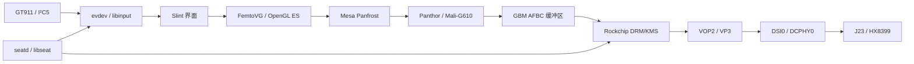

# Slint 显示实现说明

本文对应 ATK-DLRK3588 的 J23、5.5 寸 1080×1920 MIPI 屏。操作命令见
[使用手册](README.md)，结果与证据见 [验收记录](PLAN.md)。

## 1. 显示和输入路径

GPU 负责绘制，VOP2 负责扫描输出，DSI 负责向面板传送数据；三者需要分别验证。
`card0`、`card1` 和 DRM 对象编号可能随探测顺序变化，应用不依赖这些固定编号。
实际输出通过 connector 名称 `DSI-1` 标识。根权限的实机验证脚本则明确针对
本板 VP3、J23 和 1080p 配置，不能直接充当其他板卡的通用测试。

程序明确选择 LinuxKMS + FemtoVG，并要求 OpenGL ES ≥ 3.0。初始化 GL 上下文后
查询真实 renderer，拒绝 llvmpipe、softpipe、SwiftShader 等软件实现。软件窗口
只在宿主机单元测试中编译使用。生产程序不依赖 X11、Wayland compositor 或桌面。

## 2. 接口、电源和时序

| 项目 | 正式配置 | 依据或边界 |
| --- | --- | --- |
| 插座 | J23 | 用户实际接线；原厂原理图名称为 MIPI DSI1 |
| SoC/DRM 名称 | `dsi0` / `DSI-1` | 控制器地址 `fde20000`；不要把插座名称中的 1 当成 Linux dsi1 |
| 输出路由 | VP3 → DSI0 → DCPHY0 → HX8399 | J23 专用设备树的 graph endpoints |
| 面板 | ATK-MD0550 1080p，5.5 寸，1080×1920 | 用户规格、ADC 和 HX8399 ID 共同确认 |
| DSI | 4 lanes、RGB888、video burst、连续时钟、发送 EoT | `mode_flags` 没有 `NO_EOT_PACKET` 或 `LPM` |
| 模块供电 | `vcc5v0_sys`，5 V 固定电源 | 内部偏压没有软件控制；电源框架报告不是模拟电压测量 |
| 面板复位 | GPIO4_A3，active low | GPIO descriptor API，逻辑 1 表示拉低复位 |
| 背光 | PWM1，周期 25000 ns（40 kHz） | 10 档，设备树默认档位 7；systemd 可恢复已保存亮度，验收时为 9 |
| 触摸 | I²C5、GT911、地址 0x5d | INT=GPIO3_C0，RESET=GPIO3_C1；范围 1080×1920 |
| 面板识别 | 主线 SARADC ADC7 | 9 次采样取中位数；12-bit 值、波动和匹配容差均检查 |

J24 对应 SoC `dsi1`、I²C6、GPIO4_A4、PWM15。两个插座共用 ADC7，因此识别电阻
不能识别插座。ADC 名义值 0 / 1410 / 2748 对应 5.5 寸 720p / 5.5 寸 1080p /
10.1 寸 800p；本项目只实现并验收了 J23 的 1080p profile。

| 时钟或时序 | 值 | 含义 |
| --- | --- | --- |
| DSI 系统时钟 | CPLL / 4 = 375 MHz | 使用标准 assigned-clock 属性固定；本次消除黑屏的配置 |
| VOP 像素时钟 | 118.8 MHz | 与本板可输出的时钟一致；SDK 名义值为 119 MHz |
| DSI lane rate | 驱动计算为 792 Mbit/s/lane | RGB888 × 像素时钟 / 4 lanes，再乘 burst 带宽余量 10/9 |
| PPI word clock | 49.5 MHz | 上述 lane rate / 16；不是像素时钟 |
| H active / front porch / sync / back porch | 1080 / 10 / 6 / 32 | H total=1128 |
| V active / front porch / sync / back porch | 1920 / 20 / 6 / 10 | V total=1956 |
| 刷新率 | 约 53.84 Hz | 118800000 / (1128 × 1956)，并非 60 Hz |
| 预扫描同步宽度 | 最小 8 像素 | VOP 内部约束；实际传输的 HSync 仍为 6 |

继承 SPLL 的配置有背光但黑屏，切换 CPLL 后用户确认正确 UI。未测得 SPLL 的
物理频率，不能把“实际频率减半”当成本板已证实的原因。固化方式选择 CRU 管理的
父时钟，没有伪造 fixed-clock 频率，也没有修改全局 PLL 或刷写 U-Boot。

## 3. 面板生命周期和 DSI 读回

[面板驱动](../../linux/drivers/panel-alientek-md0550.c) 是树外 DRM panel 模块，
使用 regulator、GPIO descriptor、DRM backlight 和 MIPI DSI 标准 API。

| DRM 回调 | 行为 |
| --- | --- |
| `prepare` | 启用模块电源；等待 10 ms；复位有效 100 ms；释放后等待 80 ms |
| `enable` | 上游桥已启动视频；发送 SDK 的初始化序列；Sleep Out 后等待 200 ms，Display On 后等待 255 ms |
| `disable` | 标记不可诊断；Display Off 后 50 ms，Sleep In 后 200 ms |
| `unprepare` | 复位有效，释放电源引用，等待约 10 ms |
| `remove` | 删除 debugfs；仅在仍 attached 时 detach；移除 panel；不在 host 时钟关闭后再发 DCS |

SDK profile 的 19 条初始化命令保存在驱动中，涉及解锁、电源、显示、GIP、bank
切换、VCOM 和 Gamma。命令及延时没有变成设备树中的私有字节串 ABI。
`mipi_dsi_multi_context` 传播首个错误。诊断与 enable/disable 通过 mutex 串行化。

debugfs 的 `status` 按需读取 ID、power、pixel format、自检、状态、RGB、scanline
和错误计数；关闭后返回 `ENODEV`。读取会清除错误计数，不能高频后台轮询。

DSI2 的三项读回处理：

1. 按短/长响应类型解析，返回实际字节数；排空超出调用方缓冲区的长响应。
2. 读事务短暂进入命令模式，收到响应或报错后恢复视频，避免 BTA 响应与视频竞争。
3. 模式切换允许等待 100 ms，覆盖帧边界；原 10 ms 小于当前一帧时间。

此策略可能跳过少量视频帧，适合按需诊断。完整的 BTA 视频时隙配置及其他面板上的
适用性仍需单独评估；不能把本板测试等同于通用上游驱动已经获得维护者认可。

## 4. 缓冲区与应用行为

原 Slint 1.17.1 LinuxKMS 后端未按主平面的 IN_FORMATS 协商 GBM 修饰符。
本地补丁选择可路由到目标 CRTC 的 primary plane，解析格式对应的 modifier 列表，
传给 GBM 分配接口。实际为 XRGB8888、AFBC 16×16 / YTR / SPARSE，modifier
`0x0800000000000051`，pitch 4352。数值是验收观测，应用没有写死它们。

IN_FORMATS 解析使用有边界检查的 native-endian 读取，避免未对齐强制转换；
测试覆盖格式掩码和截断数据。原始 crate、许可证与唯一补丁的来源见
[后端补丁说明](patches/README.md)。

| 应用文件 | 职责 |
| --- | --- |
| [main.rs](src/main.rs) | 参数、后端选择、1 秒采样定时器、信号、事件循环和截图 |
| [gpu.rs](src/gpu.rs) | GL 身份检查、渲染回调、帧日志；仅 `glGetString` 边界允许并解释 unsafe |
| [metrics.rs](src/metrics.rs) | `/proc/uptime`、`MemTotal/MemAvailable`、按 thermal type 查找温度；失败显示 N/A |
| [dashboard.slint](ui/dashboard.slint) | 状态卡片、窄屏竖排/宽屏横排、按钮和 GPU 测试色块 |
| [snapshot.rs](src/snapshot.rs) | 仅 `cfg(test)` 的无窗口系统测试后端 |
| [build.rs](build.rs) | 编译 Slint UI |

Pause 只暂停指标采样；Count 仍可点击；Reset 只清零计数，不切换 Pause 状态。
计数达到一百万后回绕。每秒采样不表示 GPU 或面板刷新率被限制为 1 FPS。

SIGTERM/SIGINT 通过定时器退出事件循环。SIGUSR1 请求新绘制，即使暂停也能截图。
截图位于 AfterRendering、GBM swap 之前，避免读到旧缓冲区；它是 GPU 回读，
不是屏幕照片。`GPU_FRAME` 是渲染回调计数，也不能单独证明玻璃上的图像。

## 5. 服务与交付文件

| 源文件/目录 | 交付作用 |
| --- | --- |
| [display.config](../../linux/configs/display.config) | 固定 DRM、Panthor、Rockchip VOP/DSI/PHY、Goodix、PWM、IIO 等选项 |
| [J23 DTS](../../linux/dts/rk3588-atk-dlrk3588-mipi-1080p.dts) | 面板、时钟、背光、触摸和端点 |
| [基础 DTS](../../linux/dts/rk3588-atk-dlrk3588.dts) | GPU/pd_gpu 供电、SARADC、板级公共资源 |
| [HDMI dtsi](../../linux/dts/rk3588-atk-dlrk3588-hdmi.dtsi) | HDMI TX 的端点和 FRL/bias GPIO；不代表 HDMI 实屏已验收 |
| [panel binding](../../linux/dts/bindings/display/panel/alientek,atk-md0550-1080p.yaml) | 面板 compatible、电源、复位、backlight 和 port 约束 |
| [内核补丁索引](../../linux/patches/README.md) | 原串口基础补丁和 6 项显示核心修改 |
| [build-display.sh](../../scripts/build-display.sh) | `--locked` 的 ARM64 交叉构建 |
| [display-sysroot.sh](../../scripts/display-sysroot.sh)、[display-linker.sh](../../scripts/display-linker.sh) | 目标库、pkg-config、sysroot 和链接器隔离 |
| [prepare-display.sh](../../board/prepare-display.sh) | 板上运行依赖与 CSF 固件解压 |
| [install-display.sh](../../board/install-display.sh)、[deploy-display.sh](../../scripts/deploy-display.sh) | SHA256 校验、备份、安装程序/服务并启动 |
| [slint-dashboard.service](../../board/slint-dashboard.service) | 非 root 服务和访问限制 |
| [slint-wait-display.sh](../../board/slint-wait-display.sh) | 等待 Panthor 与已连接输出 |
| [detect-mipi-panel.py](../../board/detect-mipi-panel.py)、[detect-display.sh](../../scripts/detect-display.sh) | ADC 识别及打包时选择 DTB |
| [install-display-dtb.py](../../board/install-display-dtb.py) | 早期诊断用独立 slint 启动项；正式安装使用 `make deploy` |
| [test-display-gpu.py](../../board/test-display-gpu.py) | 本板 GPU、AFBC、截图、时钟、面板与可选输入注入检查 |

专用账户 `slint-display` 的服务补充组为 `video render`，通过 libseat/seatd 获得
DRM 和输入 fd；应用 CapEff=0。`NoNewPrivileges`、空 CapabilityBoundingSet、
ProtectSystem/ProtectHome 等限制配合 `/run/slint-dashboard` 和
`/var/cache/slint-dashboard` 的可写目录。服务级 SupplementaryGroups 不等同于
该账户在任意 `runuser` 命令里都具有这些组。

应用不使用 `/dev/mem`。根权限的硬件测试为确认 DSI 已恢复视频，会只读映射本板
DSI MODE_STATUS；该诊断不属于应用运行路径。原厂 GPU/内核、raw Writeback、
寄存器试写等实验保存在被忽略的 `local/`、`build/` 或板上隔离目录中。

## 6. 维护范围

正式验收覆盖当前板卡、J23 1080p 屏、现有 U-Boot 和 Ubuntu Base。720p/10.1 寸
屏仅有 ID 识别；J24、HDMI 实屏、多显示器、不同旋转和长期热插拔尚未验收。
默认选择第一个已连接输出；同时接 HDMI 时，应在服务配置显式选择 `DSI-1`。

Goodix 使用屏内配置，内部 AVDD/VDDIO 不可由本板软件单独控制，目前使用 dummy
regulator；不把它们关联到无关的主板可控电源。RGB 读回在可见 UI 时仍为零，
不将其作为图像成功或失败的判据。

应用许可证为 GPL-3.0-only；内核、BSP 脚本、设备树和 binding 按各文件 SPDX。
所有本地内核/Slint 补丁和面板 binding 均尚未提交上游。升级时要重新核对 API、
补丁是否已合入、DT schema、GBM 修饰符、固件及整条显示链路，不能只替换一个库。
